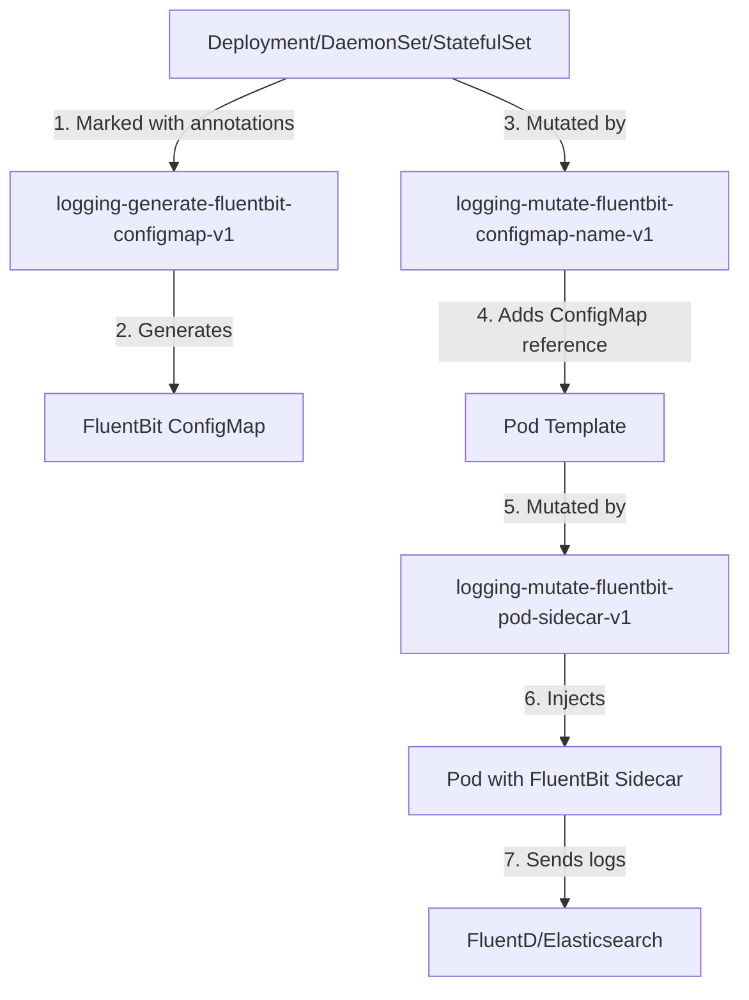

# Automatic Logging Solution with FluentBit

This solution implements an automatic centralized logging system for Kubernetes applications using FluentBit as a sidecar and Admitik as the policy engine. The system enables automatic collection, processing, and forwarding of container logs to a centralized destination (like FluentD or Elasticsearch) without the need to modify applications.

## Overview

The solution consists of three Admitik policies that work together to:

1. **Automatically generate** a ConfigMap with FluentBit configuration
2. **Mutate parent objects** (Deployments, DaemonSets, StatefulSets, etc.) to reference the configuration in the pods they will create
3. **Automatically inject** a FluentBit sidecar into pods

## Solution Architecture



## Included Policies

### 1. logging-generate-fluentbit-configmap-v1

**Purpose**: Automatically generates a ConfigMap with FluentBit configuration.

**Functionality**:
- Watches resources of type `Deployment`, `DaemonSet`, `StatefulSet`, `CronJob` and `Rollout`
- Generates a ConfigMap when the resource has the appropriate annotations
- Configures multiple inputs, filters and outputs based on the provided YAML configuration

**Generated configuration**:
- **INPUT**: Tail configuration to read logs from specific containers
- **FILTER**: Adds metadata like namespace, pod name, container name, etc. that will be used later in FluentD for ingestion into Elasticsearch
- **OUTPUT**: Forward configuration to send logs to FluentD

### 2. logging-mutate-fluentbit-configmap-name-v1

**Purpose**: Mutates parent objects to add references to the generated ConfigMap in the pods they manage.

**Functionalities**:
- Adds annotations to the pod template with the ConfigMap name
- Propagates sidecar resource configurations
- Adds labels to activate the pod mutation policy
- Handles special cases for CronJobs (jobTemplate)

### 3. logging-mutate-fluentbit-pod-sidecar-v1

**Purpose**: Injects the FluentBit sidecar into pods.

**Functionalities**:
- Adds an init container with FluentBit
- Configures necessary volumes to access logs
- Applies appropriate security configurations
- Allows resource customization through annotations

## Configuration and Usage

### Basic Activation

To activate automatic logging on a resource, add the label:

```yaml
metadata:
  labels:
    admitik.policy.v1/logging: "true"
  annotations:
    admitik.policy.v1/loggingConfig: |
      - container: "app"
        parser: "json"
        index: "my-app-logs"
        host: "fluentd.logging.svc.cluster.local"
        port: "24224"
      - container: "nginx"
        parser: "nginx"
        index: "nginx-logs"
```

### Logging Configuration

The `admitik.policy.v1/loggingConfig` annotation accepts a YAML list with the following options per container:

| Parameter | Description | Default Value |
|-----------|-------------|---------------|
| `container` | Container name | **Required** |
| `parser` | FluentD parser to use (defined in FluentD) | `json` |
| `index` | Destination index | **Required** |
| `ilm_policy_id` | ILM policy for the index | `30d` |
| `ingest_anyways` | Ingest logs even if parsing fails | `true` |
| `host` | Destination host for logs | `fluentd.logging.svc.cluster.local` |
| `port` | Destination port | `24224` |

### Resource Configuration

To customize FluentBit sidecar resources:

```yaml
metadata:
  annotations:
    admitik.policy.v1/loggingSidecarResources: |
      requests:
        cpu: "100m"
        memory: "64Mi"
      limits:
        memory: "128Mi"
```

By default, the sidecar will use these resources:
```yaml
requests:
  cpu: "50m"
  memory: "50Mi"
limits:
  memory: "50Mi"
```

### Alternative Pod Configuration

You can also configure resources directly in the pod template:

```yaml
metadata:
  annotations:
    admitik.policy.v1/fluentbitResources: '{"limits":{"memory":"100Mi"},"requests":{"cpu":"100m","memory":"50Mi"}}'
```

## Complete Example

```yaml
apiVersion: apps/v1
kind: Deployment
metadata:
  name: my-app
  namespace: default
  labels:
    admitik.policy.v1/logging: "true"
  annotations:
    admitik.policy.v1/loggingConfig: |
      - container: "app"
        parser: "json"
        index: "my-app-logs"
        ilm_policy_id: "7d"
        host: "fluentd.logging.svc.cluster.local"
        port: "24224"
      - container: "sidecar"
        parser: "regex"
        index: "sidecar-logs"
    admitik.policy.v1/loggingSidecarResources: |
      requests:
        cpu: "50m"
        memory: "64Mi"
      limits:
        memory: "128Mi"
spec:
  replicas: 3
  selector:
    matchLabels:
      app: my-app
  template:
    metadata:
      labels:
        app: my-app
    spec:
      containers:
      - name: app
        image: my-app:latest
        # ... container configuration
```

## Generated Resources

When this configuration is applied, Admitik automatically generates:

1. **ConfigMap**: `fluentbit-my-app-autogenerated` with FluentBit configuration
2. **Modified Pod**: With FluentBit sidecar automatically injected
3. **Volumes**: For access to logs, configuration and FluentBit state

## Security Features

The FluentBit sidecar runs with the following security configurations:

- `runAsNonRoot: true`
- `runAsUser: 1000`
- `allowPrivilegeEscalation: false`
- `readOnlyRootFilesystem: true`
- Limited capabilities (drop ALL)

## Requirements

- Admitik v1alpha1 or higher
- Access to `fluent/fluent-bit:4.0.2` image
- A configured log destination (FluentD, Elasticsearch, etc.)
- Permissions to create ConfigMaps in the namespace

## FluentD Configuration and Data Flow

The FluentD configuration works as the central processing hub that receives logs from FluentBit sidecars and forwards them to Elasticsearch. Here's how the FluentBit parameters control the ingestion process:

### Data Flow Overview

1. **FluentBit Collection**: FluentBit reads container logs and tags them with metadata
2. **FluentD Processing**: FluentD receives the logs, applies parsing based on the `parser` parameter
3. **Elasticsearch Ingestion**: FluentD creates indices using the `index` parameter and applies ILM policies

### FluentD Configuration Breakdown

#### 1. Sources Configuration (`01_sources.conf`)

```yaml
<source>
  @type forward
  bind "0.0.0.0"
  port 24224
  skip_invalid_event true
</source>
```

- Receives logs from FluentBit sidecars on port 24224
- The `host` and `port` parameters from FluentBit configuration determine where logs are sent

#### 2. Parsing and Filtering (`02_filters.conf`)

The FluentD filters process logs based on the **`parser` parameter** specified in the FluentBit configuration:

**JSON Parser**:
```yaml
<filter **.json>
  @type parser
  key_name log
  reserve_data true
  remove_key_name_field true
  <parse>
    @type json
  </parse>
</filter>
```

**Nginx Parser**:
```yaml
<filter **.nginx>
  @type parser
  key_name log
  reserve_data true
  remove_key_name_field true
  <parse>
    @type regexp
    expression /^(?<client_ip>[^ ]*) [^ ]* [^ ]* \[(?<nginx_time>[^\]]*)\] "(?<method>\S+) (?<uri_path>[^\"]*) (?<protocol>\S+)" (?<status>[^ ]*) (?<request_size>[^ ]*) "(?<referer>[^\"]*)" "(?<user_agent>[^\"]*)"$/
  </parse>
</filter>
```

**Parsing Failure Handling**:
```yaml
<filter **>
  @type record_transformer
  enable_ruby true
  <record>
    _parsing_failed ${record['log'] ? true : false}
  </record>
</filter>

<filter **>
  @type grep
  <and>
    <exclude>
      key _parsing_failed
      pattern ^true$
    </exclude>
    <exclude>
      key ingest_anyways
      pattern ^false$
    </exclude>
  </and>
</filter>
```

The `ingest_anyways` parameter controls whether logs that fail parsing are still forwarded to Elasticsearch or dropped.

#### 3. Elasticsearch Output (`04_outputs.conf`)

The output configuration uses FluentBit parameters to control Elasticsearch ingestion:

```yaml
<match **>
  @type elasticsearch
  hosts "#{ENV['ELASTICSEARCH_HOST']}"
  index_name ${index}-${ilm_policy_id}
  enable_ilm true
  ilm_policy_id ${ilm_policy_id}
  template_name ${index}-${ilm_policy_id}
  # ... other configurations
</match>
```

**Parameter Usage in Elasticsearch**:

- **`index`**: Creates the base index name (e.g., `my-app-logs-7d`)
- **`ilm_policy_id`**: Applies Index Lifecycle Management policy (e.g., `7d`, `30d`)
- **Combined**: Results in indices like `my-app-logs-7d-2024.01.15`

#### 4. Index Template (`05_index_template.tpl`)

The template ensures consistent mappings across all indices:

```json
{
  "index_patterns": ["${index}-*"],
  "template": {
    "settings": {
      "index": {
        "number_of_shards": "3",
        "number_of_replicas": "1",
        "refresh_interval": "30s"
      }
    },
    "mappings": {
      "properties": {
        "log": {"type": "text"},
        "duration": {"type": "float", "ignore_malformed": true},
        "upstream_connect_time": {"type": "float", "ignore_malformed": true}
        // ... additional field mappings
      }
    }
  }
}
```

### Parameter Control Flow

1. **FluentBit Tags**: Logs are tagged as `{container}.{parser}` (e.g., `app.json`, `webserver.nginx`)
2. **FluentD Routing**: Filters match these tags to apply appropriate parsing
3. **Metadata Injection**: FluentBit adds `index`, `ilm_policy_id`, `ingest_anyways` as record fields
4. **Elasticsearch Indexing**: FluentD uses these fields to:
   - Create the correct index name
   - Apply the appropriate ILM policy
   - Handle parsing failures based on `ingest_anyways`

### Example Data Flow

For a FluentBit configuration with:
```yaml
- container: "app"
  parser: "json"
  index: "my-application"
  ilm_policy_id: "7d"
  ingest_anyways: "true"
```

The flow is:
1. **FluentBit** tags logs as `app.json` and adds metadata
2. **FluentD** matches `**.json` filter and parses as JSON
3. **FluentD** creates index `my-application-7d-2024.01.15`
4. **Elasticsearch** stores logs with 7-day retention policy

## Troubleshooting

### Sidecar Not Injected

1. Verify that the label `admitik.policy.v1/logging: "true"` is present
2. Confirm that the annotation `admitik.policy.v1/loggingConfig` is valid YAML
3. Check Admitik logs for validation errors

### Logs Not Reaching Destination

1. Verify network connectivity to the destination host
2. Check FluentBit container logs
3. Confirm that the specified parser is valid in FluentD
4. Verify the destination index configuration
5. Check FluentD logs for parsing errors

### Resource Issues

1. Adjust resource configuration based on needs
2. Monitor memory and CPU usage of the sidecar
3. Consider adjusting `Mem_Buf_Limit` in FluentBit configuration

## Performance Considerations

- FluentBit sidecar consumes additional resources per pod
- Logs are processed locally before forwarding, reducing latency
- The `Mem_Buf_Limit` configuration prevents excessive memory consumption
- `Retry_Limit` prevents infinite loops in case of connectivity failures
- FluentD buffering and batching optimize Elasticsearch ingestion performance